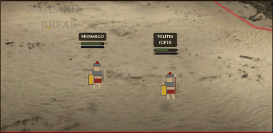
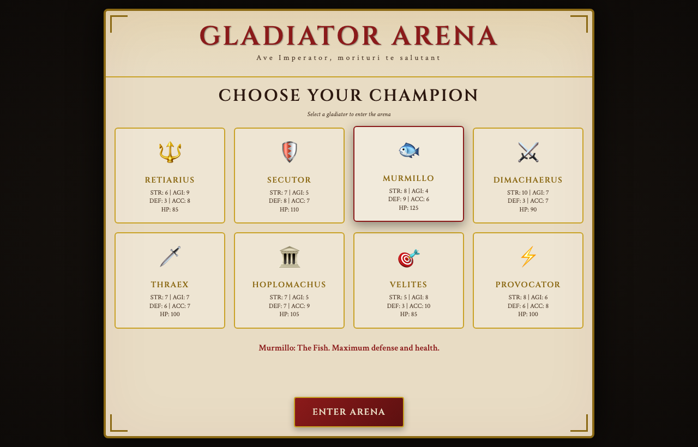
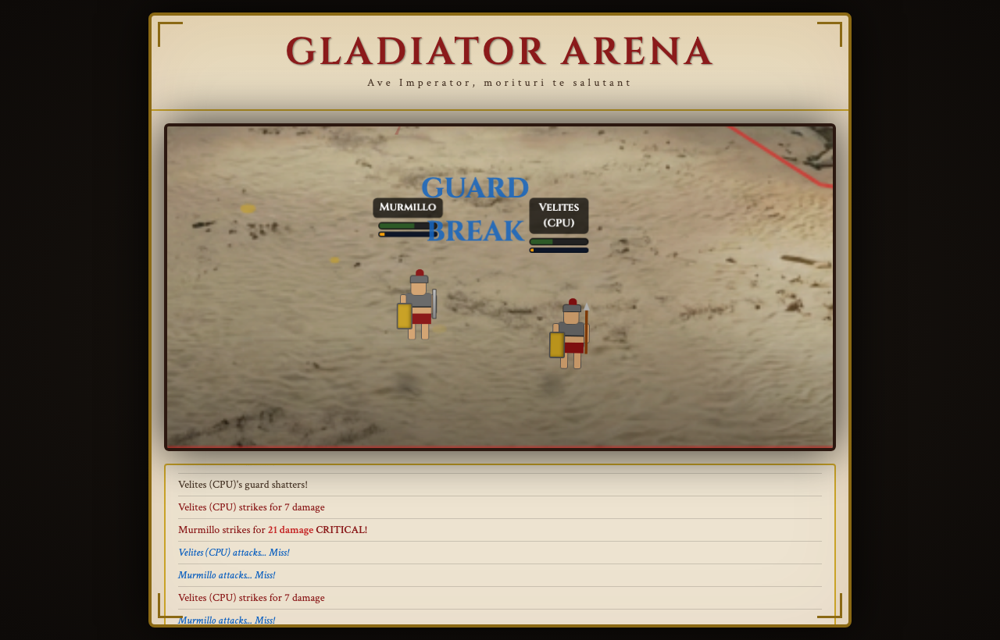
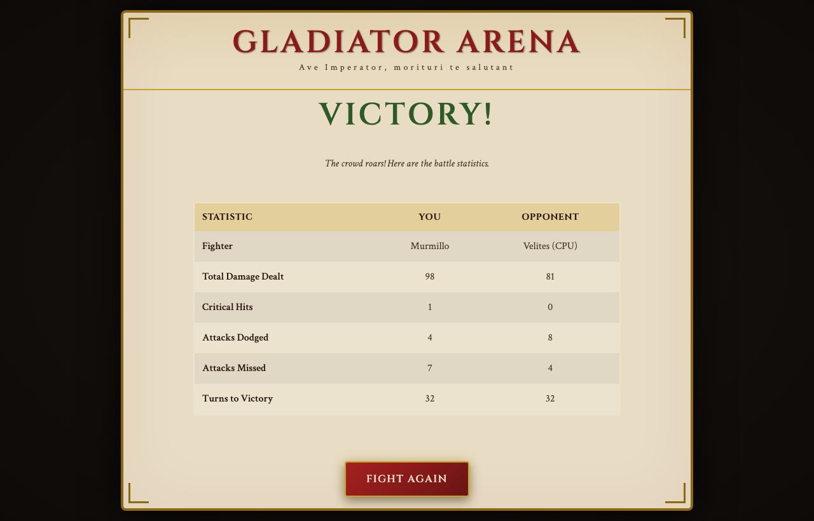

# Gladiators

A 2D gladiator combat game prototype and the tooling around it.

**▶ [Play it in the browser](https://kondrusev33ch.github.io/gladiators/)** · [Arena markup tool](https://kondrusev33ch.github.io/gladiators/markup/)



The playable app is **[`gladiator-arena-modern`](gladiator-arena-modern/)** — a real-time 1v1 arena fight in the browser (TypeScript + Vite + Canvas). **[`arena_grid_markup`](arena_grid_markup/)** is a companion tool for marking up arena images with a grid, movement zone, spawn points and camera limits; its JSON output is consumed by the game.

> Status: early prototype, actively developed. Expect placeholder art and frequent changes.

## Repository layout

| Path | What it is |
| --- | --- |
| [`gladiator-arena-modern/`](gladiator-arena-modern/) | The game. Vite + TypeScript + Tailwind, canvas rendering, real-time combat, behavior-tree AI. |
| [`arena_grid_markup/`](arena_grid_markup/) | Arena markup tool. Loads an arena image, lets you paint the walkable zone, place spawn points for 1v1…7v7 and set camera limits, exports JSON. |
| [`images/`](images/) | AI-generated reference art and concept images (armor concepts, arena backgrounds, body/sprite studies). Not used at runtime. |
| [`lore/story.md`](lore/story.md) | World-building notes for the game universe. |
| [`ROADMAP.md`](ROADMAP.md) | Development roadmap: what is done and what is planned. |

The two apps are independent npm projects; there is no root `package.json`. Install and run each from its own directory.

## Quick start

Requires Node.js 20+ (Vite 7).

### Game

```bash
cd gladiator-arena-modern
npm install
npm run dev        # http://localhost:3000
```

Other scripts: `npm run build`, `npm run preview`, `npm run lint`, `npm run type-check`, `npm run format`.

### Arena markup tool

```bash
cd arena_grid_markup
npm install
npm run dev
```

Other scripts: `npm run build`, `npm run preview`.

## How the pieces fit together

```
arena image (PNG)
      │
      ▼
arena_grid_markup ──► arena-config.json ──► gladiator-arena-modern/arena/config/
                                                    │
                                                    ▼
                                    grid, movement zone, spawn points,
                                    camera zoom/pan limits, fighter scale
```

1. Draw or generate an arena background image.
2. Open it in the markup tool, set the grid size, paint the movement zone, place spawn points for each match size and configure the camera.
3. Export the JSON and drop it into `gladiator-arena-modern/arena/config/`; put the image into `gladiator-arena-modern/public/images/arena/`.
4. The game reads the config at build time and derives fighter movement bounds, starting positions, camera constraints and sprite scale from it.

The config format is documented in [`arena_grid_markup/README.md`](arena_grid_markup/README.md#export-format).

## What the game does today

- Real-time combat on a fixed 60 Hz timestep, decoupled from rendering
- Stamina and initiative economy; attacks with wind-up / active / recovery phases
- Blocks (chip damage, guard break), parries with counter-attacks, dodges and dashes with i-frames
- Footwork and spacing: fighters keep distance, back-pedal, strafe and lunge
- Behavior-tree AI with difficulty profiles (novice / veteran / champion)
- Layered canvas rendering with particles, sprite shadows, hit-stop, slow motion, camera shake and chromatic aberration
- Grid-based arena loaded from JSON: walkable zone, spawn points, camera bounds and zoom limits
- Playable loop: pick one of 8 gladiator classes, fight a CPU opponent, see the results

See [`gladiator-arena-modern/README.md`](gladiator-arena-modern/README.md) for mechanics, architecture and configuration, and [`ROADMAP.md`](ROADMAP.md) for what comes next (sprites, animation system, arenas, team battles, audio, progression).

## Screenshots

| Choose a fighter | Battle | Results |
| --- | --- | --- |
|  |  |  |

## How it was built

The code was developed with [Claude Code](https://claude.com/claude-code), working through the phased plan in [`ROADMAP.md`](ROADMAP.md) with strict TypeScript, ESLint and Prettier as guard rails. Concept art and the arena background were generated with Google Gemini (see [License](#license)).

## Deployment

Every push to `main` builds both apps and publishes them to GitHub Pages via [`.github/workflows/deploy.yml`](.github/workflows/deploy.yml): the game at `/gladiators/` and the markup tool at `/gladiators/markup/`.

## License

Source code is released under the [MIT License](LICENSE).

All artwork in this repository — the concept images in `images/` (armor, arena backgrounds, body and sprite studies) and the arena background shipped with the game — was generated with AI tools (Google Gemini and similar) by the repository author. It is provided as-is for reference and is not covered by the code license. No third-party or stock artwork is included.
